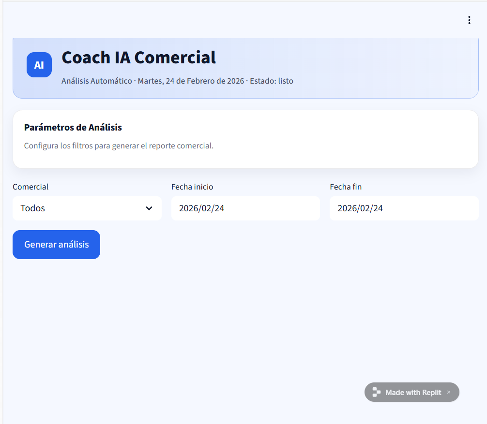

# Coach IA Comercial — Analista de Llamadas (Venta Consultiva)

## Descripción del agente

Coach IA Comercial es un agente diseñado como Director Comercial de una escuela de negocios.

Su función es analizar transcripciones de llamadas comerciales para evaluar la ejecución del embudo de venta consultiva, el cumplimiento de las fases del speech y el grado de personalización de la conversación.

El análisis se basa exclusivamente en un Documento de Referencia que actúa como fuente de verdad.

---

## Problema que resuelve

En equipos comerciales, la revisión cualitativa de llamadas suele hacerse de forma manual, subjetiva y poco sistemática.

Este agente permite:

- Estandarizar la evaluación del speech comercial  
- Detectar fases omitidas o mal ejecutadas  
- Identificar redundancias y muletillas  
- Evaluar el nivel de venta emocional  
- Medir el grado de personalización  
- Generar recomendaciones accionables  

Automatiza un proceso que normalmente requeriría supervisión manual por parte de un Director Comercial.

---

## Rol del agente

El agente actúa como:

> Director Comercial especializado en venta consultiva en escuela de negocios.

No realiza un análisis genérico.  
Evalúa cada llamada según un Documento de Referencia que define:

- Fases del speech  
- Principios de venta consultiva  
- Criterios de personalización  
- Métricas de cobertura y redundancia  

El modelo genera siempre una respuesta estructurada y basada en estas reglas.

---

## Diseño conceptual (Sprints previos)

Este prototipo respeta el diseño definido en fases anteriores del proyecto:

- Identidad clara y rol explícito  
- Documento de verdad como fuente exclusiva  
- Evaluación estructurada por fases  
- Métricas de cobertura y redundancia  
- Evaluación emocional y centrada en el alumno  
- Plan de mejora accionable  

El agente puede realizar tanto:

- Análisis individual de llamadas  
- Análisis agregado de múltiples llamadas en un rango temporal  

---

## Flujo básico de uso

1. El usuario selecciona:
   - Comercial  
   - Fecha inicio  
   - Fecha fin  

2. La aplicación:
   - Lee las transcripciones en formato `.txt`  
   - Filtra por comercial y rango temporal  
   - Envía las transcripciones junto con el Documento de Referencia al modelo de lenguaje  

3. El modelo genera:
   - Resumen ejecutivo  
   - Gráfica ASCII de cumplimiento por fases  
   - Gráfica ASCII de redundancias  
   - Análisis detallado por fase  
   - Evaluación de venta emocional  
   - Plan de mejora accionable  

4. La respuesta se muestra dinámicamente en pantalla.

El flujo puede repetirse con diferentes filtros.

---

## Estructura del proyecto

```
main.py
requirements.txt
.streamlit/config.toml
transcripts/
README.md
```

Las transcripciones deben tener el siguiente formato de nombre:

```
Comercial_YYYY-MM-DD_XX.txt
```

Ejemplo:

```
Gemma_2025-06-01_01.txt
```

---

## Herramientas utilizadas

- Python  
- Streamlit  
- OpenAI API (modelo gpt-4o-mini)  
- Pandas  
- Replit (entorno de desarrollo)  

---

## Configuración

1. Crear la variable de entorno en Replit:

OPENAI_API_KEY

2. Ejecutar la aplicación:

streamlit run main.py

---

## Limitaciones actuales del prototipo

En el diseño conceptual original, el agente estaba planteado para integrarse directamente con la API de Aircall para obtener automáticamente las transcripciones de llamadas.

Por limitaciones técnicas y de acceso a la API en esta fase, el prototipo utiliza transcripciones en formato `.txt` almacenadas localmente en la carpeta `transcripts/`.

Esta decisión no afecta al funcionamiento del agente, ya que:

- El análisis se realiza sobre transcripciones reales.  
- El flujo completo Input → Modelo → Output está implementado.  
- La integración con Aircall es una mejora futura a nivel de fuente de datos, no de lógica de análisis.  

En futuras iteraciones se implementará la conexión directa con Aircall para automatizar la ingesta de llamadas.

---

## Capturas del prototipo

### Pantalla de filtros



### Resultado del análisis


---

## Estado del proyecto

Sprint 3 — Prototipo funcional

Cumple el flujo completo:

Input → Procesamiento → Respuesta dinámica visible