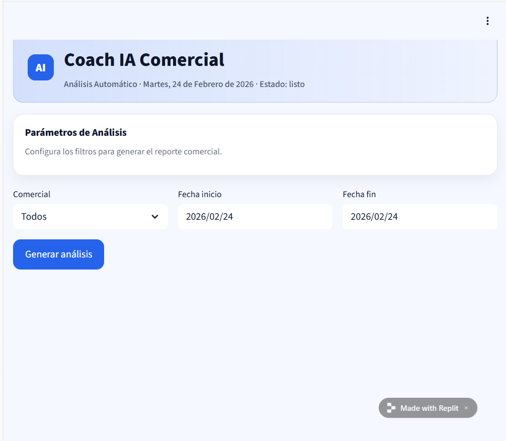

# Coach IA Comercial — Analista de Llamadas (Venta Consultiva)

## Descripción del agente

Coach IA Comercial es un agente diseñado como Director Comercial de una escuela de negocios.

Su función es analizar transcripciones de llamadas comerciales para evaluar la ejecución del embudo de venta consultiva, el cumplimiento de las fases del speech y el grado de personalización de la conversación.

El análisis se basa exclusivamente en un Documento de Referencia que actúa como fuente de verdad.

---

## Problema que resuelve

En equipos comerciales, la revisión cualitativa de llamadas suele hacerse de forma manual, subjetiva y poco sistemática.

Este agente permite:

- Estandarizar la evaluación del speech comercial  
- Detectar fases omitidas o mal ejecutadas  
- Identificar redundancias y muletillas  
- Evaluar el nivel de venta emocional  
- Medir el grado de personalización  
- Generar recomendaciones accionables  

Automatiza un proceso que normalmente requeriría supervisión manual por parte de un Director Comercial.

---

## Rol del agente

El agente actúa como:

> Director Comercial especializado en venta consultiva en escuela de negocios.

No realiza un análisis genérico.  
Evalúa cada llamada según un Documento de Referencia que define:

- Fases del speech  
- Principios de venta consultiva  
- Criterios de personalización  
- Métricas de cobertura y redundancia  

El modelo genera siempre una respuesta estructurada y basada en estas reglas.

---

## Diseño conceptual (Sprints previos)

Este prototipo respeta el diseño definido en fases anteriores del proyecto:

- Identidad clara y rol explícito  
- Documento de verdad como fuente exclusiva  
- Evaluación estructurada por fases  
- Métricas de cobertura y redundancia  
- Evaluación emocional y centrada en el alumno  
- Plan de mejora accionable  

El agente puede realizar tanto:

- Análisis individual de llamadas  
- Análisis agregado de múltiples llamadas en un rango temporal  

---

## Flujo básico de uso

1. El usuario selecciona:
   - Comercial  
   - Fecha inicio  
   - Fecha fin  

2. La aplicación:
   - Lee las transcripciones en formato `.txt`  
   - Filtra por comercial y rango temporal  
   - Envía las transcripciones junto con el Documento de Referencia al modelo de lenguaje  

3. El modelo genera:
   - Resumen ejecutivo  
   - Gráfica ASCII de cumplimiento por fases  
   - Gráfica ASCII de redundancias  
   - Análisis detallado por fase  
   - Evaluación de venta emocional  
   - Plan de mejora accionable  

4. La respuesta se muestra dinámicamente en pantalla.

El flujo puede repetirse con diferentes filtros.

---

## Estructura del proyecto

```
main.py
requirements.txt
.streamlit/config.toml
transcripts/
README.md
```

Las transcripciones deben tener el siguiente formato de nombre:

```
Comercial_YYYY-MM-DD_XX.txt
```

Ejemplo:

```
Gemma_2025-06-01_01.txt
```

---

## Herramientas utilizadas

- Python  
- Streamlit  
- OpenAI API (modelo gpt-4o-mini)  
- Pandas  
- Replit (entorno de desarrollo)  

---

## Configuración

1. Crear la variable de entorno en Replit:

OPENAI_API_KEY

2. Ejecutar la aplicación:

streamlit run main.py

---

## Limitaciones actuales del prototipo

En el diseño conceptual original, el agente estaba planteado para integrarse directamente con la API de Aircall para obtener automáticamente las transcripciones de llamadas.

Por limitaciones técnicas y de acceso a la API en esta fase, el prototipo utiliza transcripciones en formato `.txt` almacenadas localmente en la carpeta `transcripts/`.

Esta decisión no afecta al funcionamiento del agente, ya que:

- El análisis se realiza sobre transcripciones reales.  
- El flujo completo Input → Modelo → Output está implementado.  
- La integración con Aircall es una mejora futura a nivel de fuente de datos, no de lógica de análisis.  

En futuras iteraciones se implementará la conexión directa con Aircall para automatizar la ingesta de llamadas.

---

## Capturas del prototipo

### Pantalla de filtros



### Resultado del análisis


---

## Estado del proyecto

Sprint 3 — Prototipo funcional

Cumple el flujo completo:

Input → Procesamiento → Respuesta dinámica visible

## Tipo de usuario

El agente está pensado principalmente para ser utilizado por perfiles responsables de supervisión comercial, como:

- Directores comerciales
- Responsables de equipos de ventas
- Formadores comerciales
- Dirección académica en escuelas de negocio

Su función es facilitar el análisis estructurado de llamadas comerciales para mejorar la calidad del proceso de venta consultiva.

---

## Situación de uso

El agente se utiliza en contextos de supervisión y mejora del rendimiento comercial.

Algunos escenarios de uso típicos son:

- Auditoría periódica de llamadas comerciales
- Evaluación del cumplimiento del speech de ventas
- Identificación de desviaciones en el proceso consultivo
- Preparación de feedback individual para comerciales
- Detección temprana de patrones de bajo rendimiento

El sistema permite analizar múltiples llamadas de forma rápida, algo que sería difícil de realizar manualmente.

---

## Cómo funciona el agente

El agente funciona a partir del análisis automático de transcripciones de llamadas comerciales.

El flujo general es el siguiente:

1. El usuario selecciona un comercial y un rango de fechas.
2. La aplicación filtra las transcripciones disponibles.
3. Las transcripciones se envían junto con el Documento de Referencia al modelo de lenguaje.
4. El modelo analiza el contenido siguiendo el system prompt definido.
5. Se genera un informe estructurado que incluye:
   - resumen ejecutivo
   - análisis por fases del speech
   - detección de redundancias
   - evaluación de venta emocional
   - plan de mejora accionable

El análisis se muestra directamente en la interfaz de la aplicación.

---

## Evolución futura del agente

Este prototipo representa un primer MVP funcional. Existen múltiples mejoras que podrían implementarse en futuras iteraciones.

### Integración con API de Aircall

La evolución natural del sistema sería conectarlo directamente con la API de Aircall para obtener automáticamente las transcripciones de las llamadas sin necesidad de descargarlas manualmente.

Esto permitiría analizar llamadas en tiempo real o de forma periódica.

---

### Base de conocimiento de programas mediante Airtable

Otra mejora relevante sería integrar una base de datos de programas formativos mediante Airtable.

Esto permitiría que el agente evaluara no solo la ejecución del speech comercial, sino también si el programa ofrecido realmente encaja con el perfil y los objetivos del lead.

De esta forma el análisis pasaría de evaluar únicamente el **cómo se vende** a evaluar también **qué se está vendiendo**.

---

### Dashboard histórico de desempeño comercial

Almacenar los resultados de los análisis permitiría construir un dashboard con información histórica sobre el desempeño del equipo comercial.

Esto facilitaría:

- detectar tendencias
- comparar comerciales
- identificar mejores prácticas
- realizar seguimiento de mejoras en el speech.

---

### Envío automático de informes

Otra posible evolución sería generar informes automáticos que se envíen periódicamente al Director Comercial por email, facilitando la supervisión continua del equipo.

---

### Comparativa entre comerciales

El sistema podría incorporar análisis comparativos entre comerciales para detectar diferencias en la ejecución del speech y facilitar la identificación de mejores prácticas dentro del equipo.

---

## Análisis crítico del prototipo

Este proyecto demuestra que es posible automatizar el análisis cualitativo de llamadas comerciales mediante modelos de lenguaje.

El prototipo valida varios aspectos clave:

- Los modelos de lenguaje pueden analizar conversaciones complejas siguiendo reglas definidas.
- Es posible estructurar el análisis de llamadas comerciales en un informe accionable.
- Un system prompt bien diseñado permite convertir un concepto conceptual en una herramienta funcional.

Sin embargo, el prototipo también muestra limitaciones propias de un MVP:

- Dependencia de transcripciones manuales
- Interfaz básica centrada en funcionalidad
- Ausencia de almacenamiento histórico de resultados

Estas limitaciones forman parte natural de una primera iteración y abren el camino a futuras evoluciones del sistema.
