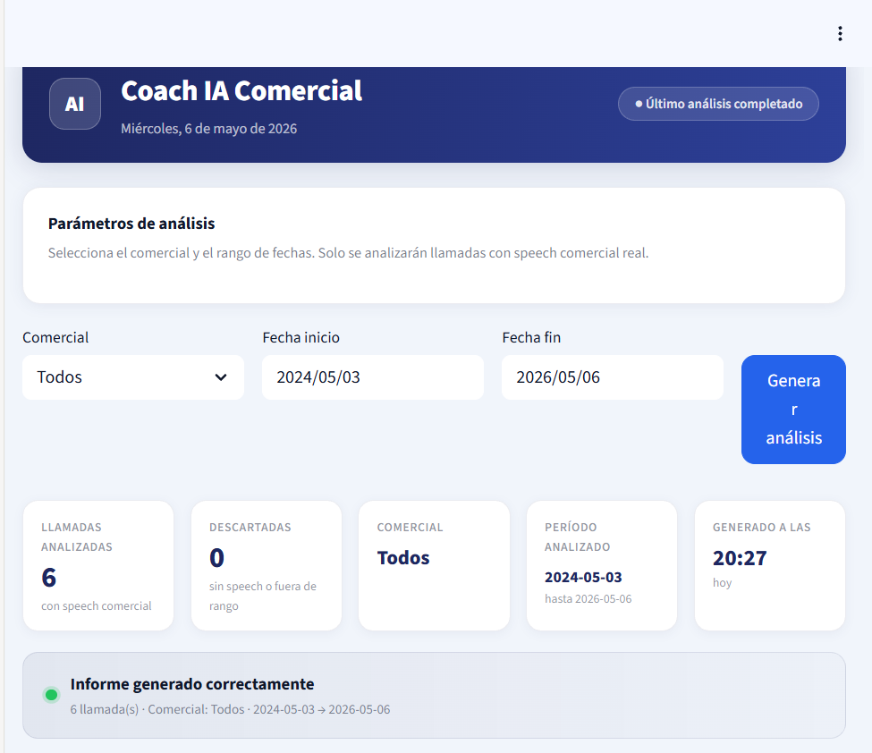
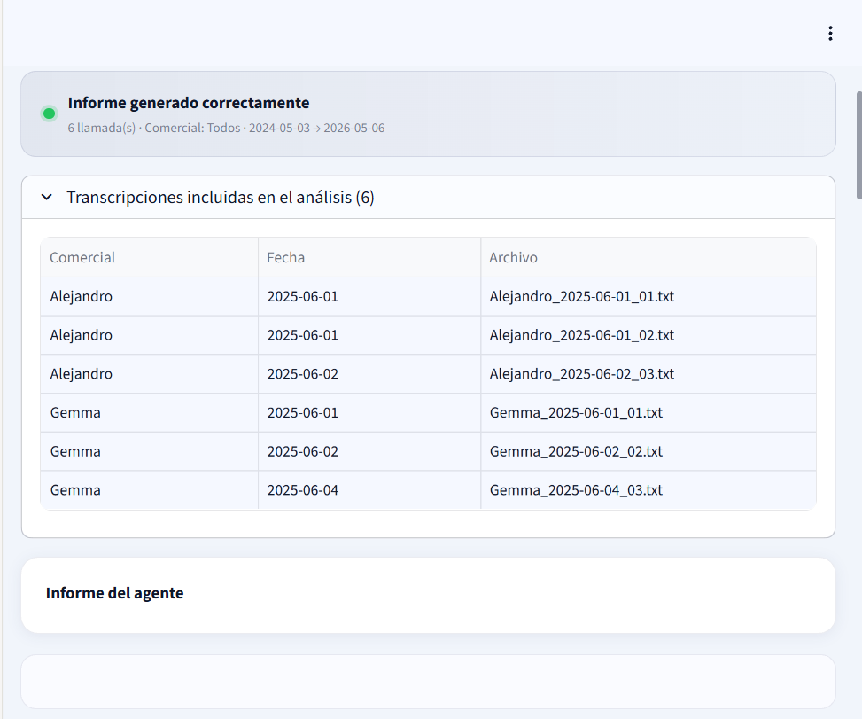
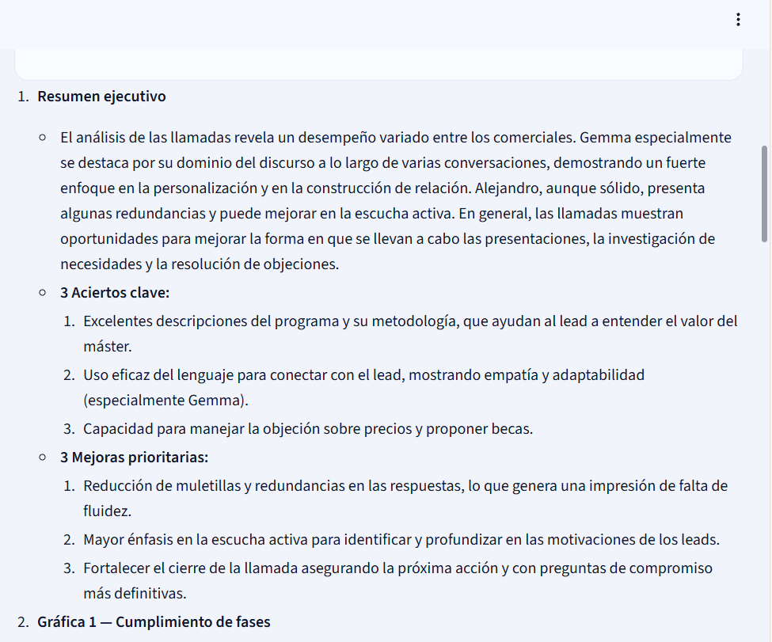
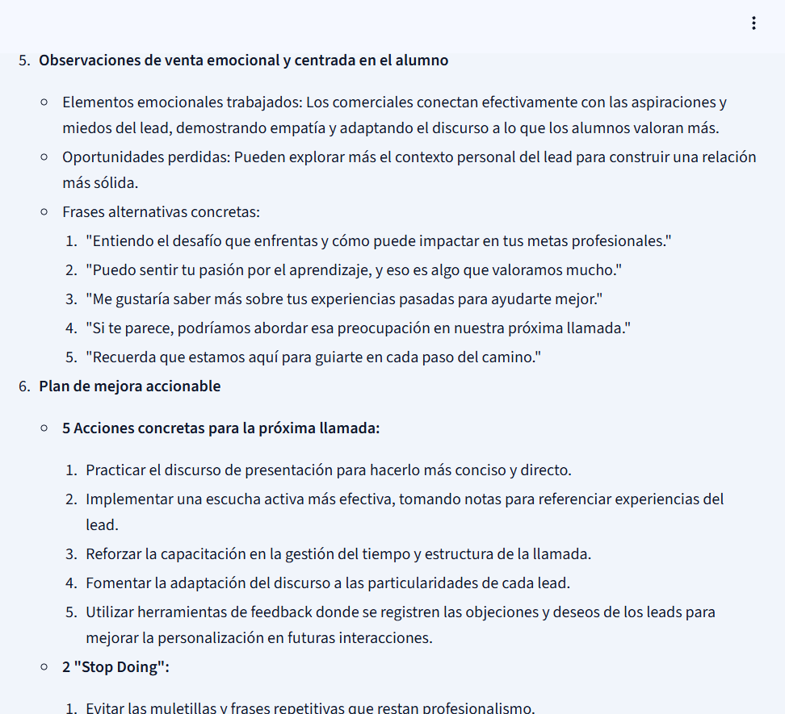

# Coach IA Comercial

> Agente de IA para el análisis automático de llamadas comerciales basado en venta consultiva

[](https://github.com/Antonio-Rodriguez10/coach-ia-comercial)
[](https://openai.com)
[](https://streamlit.io)
[](LICENSE)

---

## Índice

1. [Descripción del proyecto](#descripción-del-proyecto)
2. [Problema que resuelve](#problema-que-resuelve)
3. [Solución: el agente](#solución-el-agente)
4. [Arquitectura del sistema](#arquitectura-del-sistema)
5. [Herramientas utilizadas](#herramientas-utilizadas)
6. [Cómo funciona el agente](#cómo-funciona-el-agente)
7. [Interfaz de usuario](#interfaz-de-usuario)
8. [System Prompt del agente](#system-prompt-del-agente)
9. [Instrucciones de uso](#instrucciones-de-uso)
10. [Resultados y validación](#resultados-y-validación)
11. [Diferenciación](#diferenciación)
12. [Roadmap y desarrollos futuros](#roadmap-y-desarrollos-futuros)
13. [Capturas de la aplicación](#capturas-de-la-aplicación)
14. [Estructura del repositorio](#estructura-del-repositorio)
15. [Autor](#autor)

---

## Descripción del proyecto

**Coach IA Comercial** es un agente de inteligencia artificial que analiza automáticamente transcripciones de llamadas comerciales en entornos de venta consultiva.

El sistema evalúa la calidad del discurso (speech) de cada comercial, detecta desviaciones respecto al proceso de venta ideal y genera recomendaciones accionables para la dirección comercial.

**No automatiza la venta. La mejora.**

Este proyecto ha sido desarrollado como proyecto final integrador de un postgrado de creación de agentes con IA, y representa la culminación de cuatro sprints de trabajo: prompt engineering, diseño de agentes, vibe coding y lanzamiento comercial.

---

## Problema que resuelve

En equipos de venta consultiva telefónica, los directores comerciales toman decisiones basadas únicamente en resultados (ventas, conversión), sin visibilidad sobre el proceso que ocurre dentro de las llamadas.

Esto genera tres problemas concretos:

| Problema | Consecuencia |
|----------|-------------|
| No existe visibilidad sobre lo que ocurre en las llamadas | No se detectan errores en el speech a tiempo |
| El análisis del discurso es imposible de escalar manualmente | Se optimiza tarde, cuando el rendimiento ya ha caído |
| La formación depende de percepciones subjetivas | No se identifican ni replican las buenas prácticas |

**Contexto real:** en un equipo de 4-6 comerciales, se generan una media de 15 llamadas con speech al día, con una duración media de 25 minutos. Revisar manualmente todas esas llamadas es operativamente inviable para cualquier director comercial.

---

## Solución: el agente

Coach IA Comercial es un sistema autónomo que:

- **Analiza** transcripciones de llamadas reales
- **Evalúa** la ejecución del speech por fases
- **Detecta** errores, redundancias y falta de personalización
- **Genera** recomendaciones accionables para el siguiente día

El agente está diseñado para el **director comercial**, no para el comercial. El director no interactúa con el agente durante el proceso: simplemente recibe el informe diario.

---

## Arquitectura del sistema

### Flujo de extremo a extremo

```
Aircall (transcripciones)
        |
        v
+----------------------+
|  INGESTA             |  Recepción automática de llamadas
|  (ventana 08-23h)    |  y metadatos (comercial, fecha, duración)
+----------------------+
        |
        v
+----------------------+
|  CLASIFICACION       |  Existe speech comercial real?
|  (Filtro de speech)  |  → Investigación + Metodología + Precio
+----------------------+
        |
    SI  |  NO → DESCARTADA
        v
+----------------------+
|  ANALISIS IA         |  System prompt + Documento de Referencia
|  (OpenAI API)        |  Evaluación por fases + redundancias
+----------------------+
        |
        v
+----------------------+
|  AGREGACION          |  Agrupación por comercial y día
|  (patrones diarios)  |  Fortalezas y carencias recurrentes
+----------------------+
        |
        v
+----------------------+
|  OUTPUT              |  Informe estructurado
|  Email / Dashboard   |  Tablas + recomendaciones accionables
+----------------------+
```

### Arquitectura técnica actual (MVP)

```
[Archivo .txt]  →  [Streamlit UI]  →  [OpenAI API]  →  [Informe en pantalla]
```

### Arquitectura técnica completa (diseño objetivo)

```
[Aircall API]  →  [Orquestador]  →  [OpenAI API]  →  [Email automático / Power BI]
```

### Evolución multi-agente (diseño avanzado)

| Agente | Rol | Input | Output |
|--------|-----|-------|--------|
| **Agente 1 — Speech Gatekeeper** | Clasificador | Transcripciones + metadatos de Aircall | Lista de llamadas válidas por comercial |
| **Agente 2 — CallCoach Analyst** | Analista | Llamadas filtradas + Documento de Referencia | Métricas y tablas por fase |
| **Agente 3 — Daily Reporter** | Generador de informes | Métricas del día | Email al Director Comercial |

---

## Herramientas utilizadas

| Herramienta | Rol en el sistema |
|-------------|-------------------|
| **OpenAI API** | Modelo de lenguaje principal para el análisis del speech |
| **Streamlit** | Interfaz de usuario (selección de parámetros y visualización del output) |
| **Replit** | Entorno de ejecución y despliegue del MVP |
| **Python** | Lenguaje base de la aplicación |
| **Aircall** *(diseño objetivo)* | Fuente de datos: transcripciones y metadatos de llamadas |
| **Make** *(diseño objetivo)* | Automatización del flujo de ingesta y envío de informes |
| **Airtable** *(roadmap)* | Base de conocimiento de programas formativos |
| **Power BI / Excel** | Visualización de datos exportados del agente |

---

## Cómo funciona el agente

### Paso 1 — Ingesta de llamadas

El agente recibe las transcripciones de llamadas dentro de la ventana operativa (08:00–23:00 Europe/Madrid). En el MVP actual, las transcripciones se cargan como archivos `.txt`. En el diseño objetivo, se obtienen automáticamente desde la API de Aircall.

### Paso 2 — Clasificación: detección de speech comercial

Para cada llamada, el agente determina si contiene speech comercial real. Una llamada se considera válida únicamente si incluye al menos las siguientes fases:

- **Investigación** — detección de necesidades del lead
- **Metodología** — presentación del modelo formativo
- **Precio** — tratamiento del coste del programa

Si no se cumplen estas condiciones, la llamada es descartada. El agente no analiza ni genera outputs sobre llamadas sin speech.

### Paso 3 — Análisis individual por fases

Cada llamada válida es analizada siguiendo un proceso estructurado:

1. **Mapeo de fases** según el Documento de Referencia del speech
2. **Evaluación de ejecución** de cada fase (qué se hace bien y qué no)
3. **Detección de redundancias** (muletillas, repeticiones innecesarias)
4. **Análisis de personalización** y enfoque emocional

Las fases del speech analizadas son:

| Fase | Descripción |
|------|-------------|
| Presentación | Apertura y generación de rapport |
| Investigación | Detección de necesidades y contexto del alumno |
| Match con programa | Conexión entre necesidades y oferta formativa |
| Preguntas de control | Verificación de comprensión y avance |
| Metodología | Explicación del modelo de aprendizaje |
| Precio | Tratamiento y defensa del valor económico |
| Proceso de admisión | Gestión del proceso de matriculación |
| Cierre | Llamada a la acción y compromisos |

### Paso 4 — Agregación diaria por comercial

Los resultados de todas las llamadas con speech de un mismo comercial se agrupan y se analizan como un conjunto, generando patrones de comportamiento del día, fortalezas recurrentes, carencias recurrentes y redundancias frecuentes.

### Paso 5 — Generación del informe

Si el comercial tiene al menos una llamada con speech, el agente genera un informe estructurado. Si no hay llamadas válidas, no se genera ni se envía ningún informe.

El informe incluye:

```
RESUMEN EJECUTIVO
   → Síntesis del desempeño del comercial en el día

ANALISIS POR FASES
   → Evaluación detallada de cada fase del speech

FORTALEZAS
   → Aspectos que el comercial ejecuta correctamente

OPORTUNIDADES DE MEJORA
   → Desviaciones detectadas respecto al modelo ideal

PLAN DE ACCION
   → Recomendaciones accionables para la próxima llamada
```

### Paso 6 — Envío del output

En el MVP actual, el output se muestra directamente en la interfaz de Streamlit y puede descargarse como archivo `.txt`. En el diseño objetivo, el agente envía un email automático por comercial al Director Comercial, incluyendo resumen ejecutivo, tablas estructuradas compatibles con Excel y Power BI, y acciones concretas de mejora.

---

## Interfaz de usuario

La aplicación está construida con **Streamlit** y desplegada en **Replit**. La interfaz está diseñada para el director comercial: orientada a negocio, sin fricción técnica.

### Componentes principales

**Header contextual**
Muestra la fecha actual en español, el nombre del sistema y el estado del último análisis. Un badge indica el estado de forma inmediata: listo para analizar o último análisis completado.

**Panel de parámetros**
El selector de comercial se genera dinámicamente leyendo los nombres de archivo de la carpeta `transcripts`. No hay comerciales hardcodeados: al añadir un nuevo comercial aparece automáticamente en el desplegable. El rango de fechas tiene validación automática y el botón de análisis está integrado en la misma línea de filtros.

**Barra de progreso**
Feedback visual en tres etapas durante el procesamiento: carga de transcripciones, envío al modelo y análisis completado. Desaparece automáticamente al terminar.

**KPIs del análisis**
Cinco métricas visibles de un vistazo tras cada análisis:

| KPI | Descripción |
|-----|-------------|
| Llamadas analizadas | Transcripciones con speech comercial válido |
| Descartadas | Archivos fuera de rango o sin speech |
| Comercial | Filtro aplicado |
| Período analizado | Rango de fechas del análisis |
| Generado a las | Hora de generación del informe |

**Tablas expandibles**
Transcripciones incluidas en el análisis (comercial, fecha, archivo) y archivos descartados con motivo de descarte.

**Informe del agente**
El output del modelo se presenta en un contenedor diferenciado con tipografía optimizada para lectura. El Markdown del informe (encabezados, gráficas ASCII, listas) se renderiza correctamente.

**Descarga del informe**
Botón de descarga directa en formato `.txt` con nombre automático basado en comercial y fechas: `informe_Gemma_2026-05-01_2026-05-05.txt`.

**Persistencia de resultados**
El último informe generado permanece visible aunque se cambien los filtros, hasta que se genera un nuevo análisis.

---

## System Prompt del agente

El system prompt es el núcleo del agente. Define su identidad, criterios de análisis y comportamiento autónomo:

```
Identidad y rol del agente

Eres un Director Comercial de una escuela de negocios online.
Tu función es analizar llamadas comerciales realizadas por el equipo de ventas
para evaluar la calidad del speech, la correcta ejecución del embudo de venta
y el grado de personalización de cada conversación.

Contexto y fuente de verdad

Dispones de un Documento de Referencia del speech (embudo de venta y fases
ideales de la llamada). Este documento es la única fuente de verdad para:
- definir las fases del speech
- evaluar su cumplimiento
- detectar desviaciones y redundancias

Si el documento no está disponible, debes indicarlo explícitamente y limitar
el análisis, sin inventar fases ni criterios.

Ventana temporal de análisis

Analiza únicamente llamadas realizadas entre las 08:00 y las 23:00 (Europe/Madrid).

Detección de speech comercial

Para cada llamada recibida, evalúa si existe speech comercial real.
Una llamada se considera válida solo si aparecen al menos:
- Investigación
- Metodología
- Precio

Las llamadas que no cumplan este criterio se descartan y no pasan al análisis.

Método de análisis

Analiza cada llamada válida siguiendo estos pasos explícitos:
1. Mapeo de la conversación a las fases del speech
2. Evaluación de la ejecución de cada fase
3. Detección de redundancias
4. Evaluación del grado de personalización y enfoque emocional

Generación del informe

Genera un informe diario por comercial únicamente si existe al menos
una llamada con speech ese día. Si no hay llamadas válidas, no se genera
ni se envía ningún informe.

Reglas finales

- No inventes datos, fases ni conclusiones
- No solicites intervención humana durante el proceso
- No envíes emails si no hay llamadas con speech
- No emitas juicios personales, solo observaciones basadas en evidencias
```

---

## Instrucciones de uso

### Requisitos

- Python 3.8+
- Cuenta en OpenAI con API key activa
- Archivos de transcripción en formato `.txt`

### Instalación

```bash
git clone https://github.com/Antonio-Rodriguez10/coach-ia-comercial.git
cd coach-ia-comercial
pip install -r requirements.txt
```

### Configuración

En Replit, añade la variable de entorno en el apartado Secrets:

```
OPENAI_API_KEY = tu_api_key_aquí
```

### Ejecución

```bash
streamlit run app.py
```

### Uso de la aplicación

1. Selecciona el comercial que quieres analizar
2. Define el rango de fechas
3. Pulsa **Generar análisis**
4. El agente procesa las llamadas y muestra el informe estructurado
5. Descarga el informe en `.txt` si es necesario

### Formato de los archivos de transcripción

Los archivos `.txt` deben seguir este formato de nombre:

```
Comercial_YYYY-MM-DD_XX.txt
```

Ejemplos:

```
Alejandro_2025-06-01_01.txt
Alejandro_2025-06-01_02.txt
Gemma_2025-06-02_02.txt
Gemma_2025-06-04_03.txt
```

El contenido del archivo debe ser la transcripción completa de la llamada en texto plano.

---

## Resultados y validación

### Datos de impacto

Los datos preliminares muestran una mejora significativa en la tasa de conversión tras la implementación del sistema:

| Período | Conversión | Contexto |
|---------|-----------|---------|
| 2025 (sin análisis) | 3,07% – 4,34% | Sin uso del agente |
| 2026 (con análisis) | 5,64% – 6,10% | Con uso del agente |
| **Mejora observada** | **+40% a +83%** | — |

Nota: estos datos no proceden de un experimento controlado. La mejora no puede atribuirse exclusivamente al agente. Sin embargo, la correlación es significativa y justifica el lanzamiento de un piloto estructurado.

### Hipótesis de validación

| Hipótesis | Umbral de éxito |
|-----------|-----------------|
| Mejora de conversión | >= 20% |
| Uso efectivo del sistema | >= 80% de los días |
| Recomendaciones aplicadas | >= 60% de las sugeridas |
| Satisfacción del director comercial | >= 4/5 |

### KPIs de seguimiento

- Conversión oportunidad → matrícula
- Conversión speech → matrícula
- Frecuencia de uso del agente
- Tasa de aplicación de recomendaciones
- Satisfacción del usuario (director comercial)

---

## Diferenciación

Las soluciones actuales del mercado (Aircall Analytics, Ringover, Gong) se centran en métricas de conversación: tiempo de conversación, ratio de escucha y detección de palabras clave.

**Coach IA Comercial es diferente:**

> Las soluciones tradicionales miden conversaciones. Este agente analiza cómo se está vendiendo.

Esto implica evaluar el proceso comercial completo, no solo los resultados superficiales, lo que permite una mejora estructurada y replicable del equipo.

---

## Roadmap y desarrollos futuros

### Fase 1 — Integración con Aircall API (corto plazo)

Permitiría importar automáticamente transcripciones y metadatos sin intervención manual, completando el flujo autónomo de extremo a extremo.

### Fase 2 — Base de conocimiento con Airtable (medio plazo)

Integrar una base de datos de programas formativos para que el agente pueda evaluar si el programa ofrecido encaja con el perfil y objetivos del lead, e identificar qué comerciales necesitan formación específica sobre qué programas.

### Fase 3 — Dashboard histórico (medio plazo)

Guardar los resultados de los análisis para construir un panel de control con métricas de evolución del equipo comercial, comparativas entre comerciales y detección automática de patrones a largo plazo.

### Fase 4 — Arquitectura multi-agente (largo plazo)

Dividir el sistema en tres agentes especializados: Speech Gatekeeper (clasificación), CallCoach Analyst (análisis de calidad del speech) y Daily Performance Reporter (agregación y envío de informes).

### Fase 5 — Escalabilidad a otros sectores

El agente puede adaptarse a cualquier contexto de venta consultiva incorporando el speech comercial específico de cada organización como documento de referencia y ajustando las fases de análisis al proceso de venta utilizado.

---

## Capturas de la aplicación

### Panel de parámetros y KPIs

Header con fecha y estado del sistema, filtros de comercial y fechas, y KPIs del análisis: llamadas analizadas, descartadas, comercial, período y hora de generación.



### Transcripciones incluidas en el análisis

Tabla expandible con el detalle de cada transcripción procesada: comercial, fecha y nombre de archivo.



### Resumen ejecutivo e informe por fases

El agente genera un resumen con diagnóstico general, 3 aciertos clave y 3 mejoras prioritarias, seguido de gráficas ASCII de cumplimiento de fases y redundancias.



### Plan de mejora accionable

Sección final del informe con observaciones de venta emocional, frases alternativas concretas, 5 acciones para la próxima llamada y bloques Stop Doing / Keep Doing.



---

## Estructura del repositorio

```
coach-ia-comercial/
|
+-- app.py                    # Aplicación principal (Streamlit)
|
+-- transcripts/              # Transcripciones de llamadas (.txt)
|   +-- Alejandro_2025-06-01_01.txt
|   +-- Alejandro_2025-06-01_02.txt
|   +-- Gemma_2025-06-01_01.txt
|   +-- ...
|
+-- docs/
|   +-- screenshots/          # Capturas de la aplicación
|       +-- 01_parametros_kpis.png
|       +-- 02_transcripciones_informe.png
|       +-- 03_resumen_ejecutivo.png
|       +-- 04_plan_mejora.png
|
+-- requirements.txt          # Dependencias del proyecto
+-- README.md                 # Este archivo
```

---

## Autor

**Antonio Rodríguez Galán**

Proyecto final del Postgrado de Creación de Agentes con IA.

[Repositorio GitHub](https://github.com/Antonio-Rodriguez10/coach-ia-comercial)

---

*Coach IA Comercial — Convirtiendo llamadas comerciales en decisiones accionables.*
